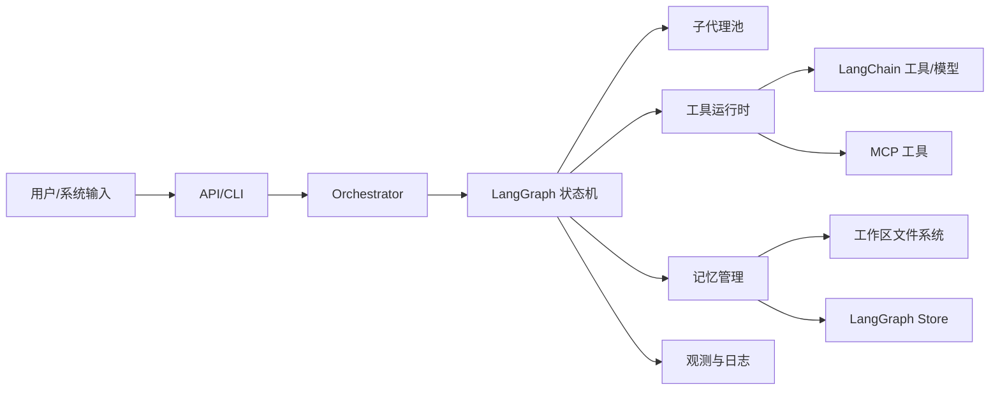
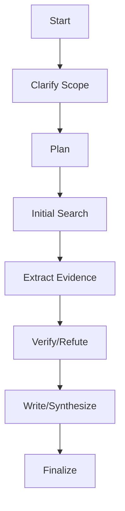

# 深度研究代理：生产级架构与实现蓝图（DeepAgents + LangGraph + LangChain）

> 目标：综合 5 个深度研究系统的实践优点，给出一套**单体可运行、可投入生产**的深度研究代理架构，覆盖多智能体设计、编排、记忆系统、工具实现、消息传递、可靠性、观测与运维。底层以 **deepagents** 为执行框架，**LangGraph** 负责状态机与图编排，**LangChain** 提供模型与工具生态。

---

## 1. 设计目标与原则

- **长时程研究**：支持多轮检索、筛选、验证与综合输出。
- **高可靠性**：错误可恢复、可回退、可复盘；减少幻觉与单源偏差。
- **可扩展性**：多智能体/多工具可插拔，易演进。
- **可追溯性**：结论绑定证据；过程可追踪与解释。
- **可控成本**：预算与早停机制，减少无效调用。
- **可落地**：单进程即可运行，后续可平滑拆分。

---

## 2. 五个系统的优点总结（架构 / 编排 / 工具 / 记忆）

### 2.1 优势矩阵（摘要）

| 系统                       | 架构优点             | 编排优点          | 工具优点           | 记忆优点            | 生产启示               |
| ------------------------ | ---------------- | ------------- | -------------- | --------------- | ------------------ |
| **DeepResearch**         | ReAct 循环 + 压缩工作区 | 工具调用-观察闭环     | 搜索/阅读/解析/沙箱齐全  | 压缩报告块控制上下文      | 用“工作区+压缩块”稳住长程任务   |
| **deep-research**        | 思考模型/任务模型分层      | 阶段化流水线 + 迭代深挖 | SERP 生成 + 多源搜索 | 本地历史/报告保存       | 计划-执行模型分离提升质量与成本控制 |
| **DeepResearchAgent**    | 分层多智能体           | 主管-执行 + 路由规则  | 深度研究/分析/浏览/MCP | 可输出运行摘要         | 子代理可视为工具，实现清晰编排    |
| **DeepSearchAgent-Demo** | 节点化流水线           | 结构-搜索-反思-汇总   | 单一搜索+LLM总结     | JSON 状态持久化      | 明确阶段状态 + 兜底逻辑稳定输出  |
| **MiroThinker**          | MCP 工具管理器        | 重复检测 + 回退重试   | MCP 多工具统一管理    | Recency 窗口 + 回退 | 去重/回滚策略显著提升稳定性     |

### 2.2 可直接复用的生产级优势

- **ReAct 工具闭环 + 工作区压缩**（DeepResearch）：适合长程、多轮任务。
- **双模型分工（规划/执行）**（deep-research）：提升计划质量并降低执行成本。
- **主管-执行 + 子代理工具化**（DeepResearchAgent）：便于扩展与治理。
- **阶段化流水线 + 状态持久化**（DeepSearchAgent-Demo）：可靠、可恢复。
- **重复检测 + 回退重试**（MiroThinker）：显著降低死循环与无效成本。

---

## 3. 生产级单体总体架构（分层与边界）

### 3.1 单体模块边界

- **接口层**：API/CLI/GUI，负责输入校验、鉴权、限流。
- **编排层**：研究状态机、预算控制、阶段流转、并行调度。
- **智能体层**：Orchestrator + 专家代理池（研究/验证/写作/浏览）。
- **工具层**：检索/抓取/解析/计算/数据库/外部 API。
- **记忆层**：短期上下文、工作区文件、长期存储（LangGraph Store）。
- **观测与治理层**：日志、指标、追踪、成本、审计。

### 3.2 单体架构图（Mermaid）



### 3.3 数据流（单体）

1. 用户任务 → API 校验 → Orchestrator 生成计划与预算。
2. LangGraph 运行状态机 → 触发工具/子代理。
3. 工具结果 → 证据抽取 → 写入工作区与记忆。
4. 验证与冲突处理 → 综合写作 → 最终报告。

---

## 4. 智能体编排（生产级可执行）

### 4.1 角色与职责

- **Orchestrator（总控）**：任务理解、阶段化编排、预算控制、结果融合。
- **Planner**：输出子问题清单、完成标准与检索策略。
- **Researcher**：多源检索、证据抽取与去重。
- **Verifier/Critic**：交叉验证、反驳与冲突检测。
- **Synthesizer**：结构化汇总与报告写作。
- **Browser Agent（可选）**：网页交互与实时信息获取。

### 4.2 研究状态机（阶段化）

1. **范围澄清**
2. **计划生成**
3. **初次检索**
4. **证据抽取与去重**
5. **反驳与验证**
6. **综合写作**
7. **终止与输出**



### 4.3 编排控制策略

- **预算控制**：最大轮次、最大工具调用、最大成本、最大时间。
- **早停策略**：信息充分 / 冲突已消解 / 预算超限 / 重复率高。
- **回退策略**：重复查询、上下文溢出 → 回滚最近一轮。
- **并行策略**：按子问题并行检索，合并后统一分析。

---

## 5. 消息与任务协议（生产可执行）

### 5.1 核心消息类型

- `task`：原始用户目标
- `plan`：任务拆分与检索策略
- `tool_call`：工具调用请求
- `observation`：工具返回与错误信息
- `critique`：验证/反驳/冲突报告
- `summary`：阶段总结与压缩记忆块
- `final`：最终报告

### 5.2 推荐消息结构（简化版）

```json
{
  "id": "msg-uuid",
  "type": "tool_call",
  "parent_id": "msg-parent",
  "role": "orchestrator | agent | tool",
  "timestamp": "2026-01-24T00:00:00Z",
  "payload": { "name": "search", "args": { "query": "..." } },
  "meta": { "budget_left": 12, "step": 4, "trace_id": "..." }
}
```

### 5.3 证据记录结构（建议）

```json
{
  "claim": "结论或要点",
  "source": "站点/文档/数据库",
  "title": "来源标题",
  "url_or_ref": "可追踪引用",
  "time": "2026-01-24",
  "confidence": 0.78,
  "notes": "与问题的关联"
}
```

---

## 6. 工具系统设计（可治理、可扩展）

### 6.1 核心工具集合

- **检索**：通用搜索 + 学术/垂直搜索
- **抓取/阅读**：网页读取、正文抽取、摘要
- **解析**：PDF/Word/表格解析
- **计算**：Python 沙箱/表达式计算
- **数据查询**：数据库/内部 API
- **记忆**：读写工作区、向量检索

### 6.2 工具治理与可靠性

- 统一 **schema 描述** + 参数校验
- **超时 + 重试 + 退避**（指数退避）
- **失败回退**（备用工具/降级输出）
- **缓存与去重**（查询级与结果级）
- **可信度标注**（来源级 + 证据级）

### 6.3 MCP 工具接入（生产建议）

- 使用 `langchain-mcp-adapters` 的 `MultiServerMCPClient` 统一接入。
- MCP 工具作为 LangChain 工具注入 deepagents 运行时。
- 支持 stdio 与 streamable HTTP，并设置超时与鉴权。

---

## 7. 记忆系统（分层 + 压缩 + 证据表）

### 7.1 记忆分层

- **短期记忆**：最近回合上下文与工具结果（recency 窗口）。
- **工作记忆**：任务状态、子问题进度、证据表。
- **长期记忆**：历史研究结论与用户偏好（LangGraph Store）。
- **程序性记忆**：研究 SOP、失败教训、工具策略。
- **文件系统记忆**：工作区文档与证据日志。

### 7.2 压缩策略（生产级）

- 观测超出阈值 → 生成 `summary` 块。
- 保留关键证据：来源、时间、可信度。
- 采用“最近 K 条观测 + 压缩块”的混合策略。
- 对重复查询触发“回滚 + 重写查询”。

---

## 8. 可靠性与质量控制

- **多源交叉验证**：至少 2 个来源支持关键结论。
- **冲突检测**：冲突时触发 Verifier 复核与再检索。
- **去重与反偏差**：重复查询与单源偏差检测。
- **离线评估**：可选 LLM-as-judge / 基准集回归测试。
- **可追溯输出**：每个结论绑定证据条目。

---

## 9. 可观测性与运维

- **日志**：工具调用、错误、摘要块、最终输出。
- **指标**：成本、延迟、成功率、重复率、证据覆盖率。
- **追踪**：Trace ID 贯穿任务与子代理。
- **审计**：结论-证据映射，可回放研究轨迹。

---

## 10. 安全与合规

- **密钥治理**：API key 分层管理与最小权限。
- **域名白名单**：限制可访问站点与工具。
- **内容过滤**：对敏感/不可信内容做拦截或标记。
- **沙箱隔离**：代码执行与文件访问最小化。

---

## 11. 单体部署模式（可生产）

### 11.1 形态

- 单进程服务内含编排与工具调用。
- 本地文件系统作为工作区与日志存储。
- LangGraph Store 作为持久化记忆。

### 11.2 运行建议

- 单体内保持 **模块化边界**，为后续拆分预留接口。
- 以 **配置驱动** 管理模型、工具、预算、并发。

---

## 12. deepagents + LangGraph + LangChain 落地映射

### 12.1 能力映射表

| 能力   | deepagents                       | LangGraph     | LangChain                 |
| ---- | -------------------------------- | ------------- | ------------------------- |
| 任务规划 | TodoListMiddleware / write_todos | State Machine | -                         |
| 子代理  | SubAgentMiddleware / task        | 子图封装          | -                         |
| 文件记忆 | FilesystemMiddleware             | Store 写入      | -                         |
| 状态流转 | -                                | Graph Runtime | -                         |
| 工具生态 | -                                | -             | Tool Schema + MCP Adapter |

### 12.2 关键中间件（建议）

- `TodoListMiddleware`：强制计划与进度更新。
- `FilesystemMiddleware`：证据/摘要落盘，降低上下文压力。
- `SubAgentMiddleware`：研究/验证/写作子代理可插拔。

---

## 13. 推荐工作区结构（生产可落地）

```
research_workspace/
├── problem.md          # 问题与范围
├── plan.md             # 计划与子问题
├── search_log.md       # 查询与检索日志
├── evidence.csv        # 证据表（来源/时间/可信度）
├── conflicts.md        # 冲突与争议点
├── drafts/             # 过程性草稿
├── final.md            # 最终报告
└── assets/             # 图表与附件
```

---

## 14. 端到端流程（生产可执行）

1. 输入任务 → 生成计划
2. 并行检索 → 抽取证据 → 去重
3. 交叉验证 → 冲突检测
4. 生成总结 → 写作
5. 输出最终报告 + 证据表 + 轨迹日志

---

## 15. 生产交付清单（建议）

- [ ] 预算与早停策略已配置（轮次/成本/时间）
- [ ] 证据表与冲突表写入启用
- [ ] 工具超时、重试、回退策略生效
- [ ] 日志、指标、追踪可用
- [ ] MCP 工具鉴权与白名单配置完毕

---

## 16. 小结

这套架构以 **Orchestrator + 多专家代理 + 多层记忆 + 工具治理 + 可靠性控制** 为核心，借助 deepagents 的中间件能力与 LangGraph 的状态机编排，在单体形态即可稳定运行，同时保留未来拆分的清晰边界。它能够支持复杂研究场景的深度检索、证据化输出与可追踪的研究流程。
