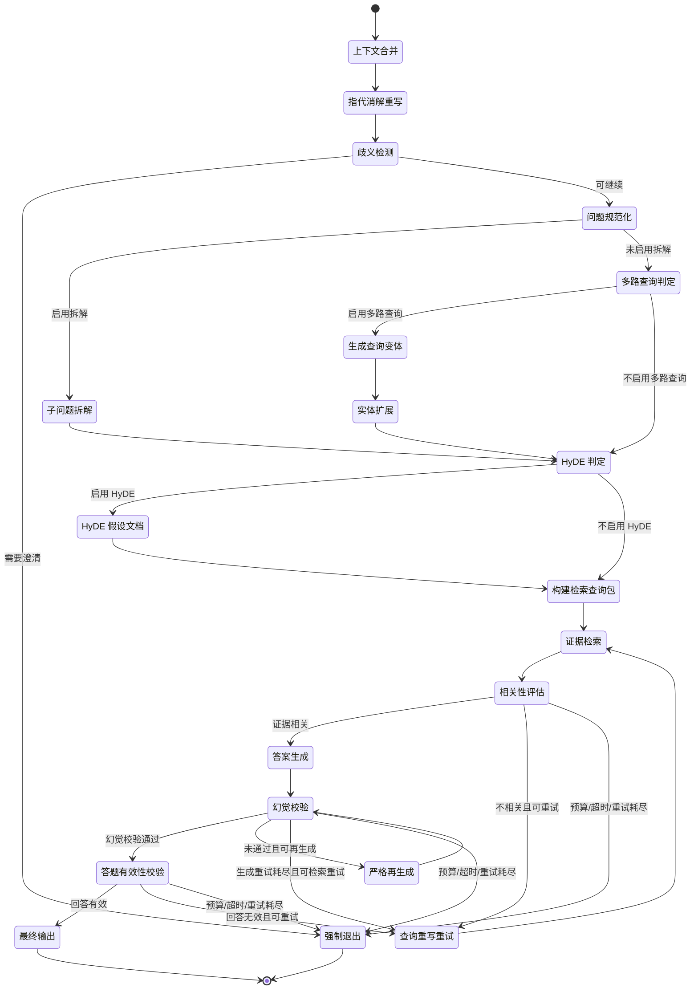
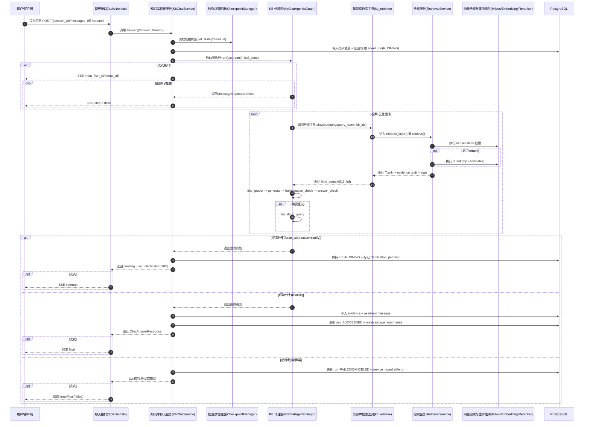

# 节点状态机图 + 时序图（Mermaid）

## 节点状态机图

```mermaid
stateDiagram-v2
    state "上下文合并" as merge_context
    state "指代消解重写" as coref_rewrite
    state "歧义检测" as ambiguity_check
    state "问题规范化" as normalize_rewrite
    state "子问题拆解" as decomposition
    state "多路查询判定" as multi_query_check
    state "生成查询变体" as generate_variants
    state "实体扩展" as entity_expand
    state "HyDE 判定" as hyde_check
    state "HyDE 假设文档" as hyde
    state "构建检索查询包" as prepare_messages
    state "证据检索" as retrieve
    state "相关性评估" as doc_grader
    state "查询重写重试" as transform_query
    state "答案生成" as generate
    state "严格再生成" as generate_strict
    state "幻觉校验" as hallucination_check
    state "答题有效性校验" as answer_check
    state "最终输出" as finalize
    state "强制退出" as force_exit

    [*] --> merge_context

    merge_context --> coref_rewrite
    coref_rewrite --> ambiguity_check

    ambiguity_check --> force_exit: 需要澄清
    ambiguity_check --> normalize_rewrite: 可继续

    normalize_rewrite --> decomposition: 启用拆解
    normalize_rewrite --> multi_query_check: 未启用拆解

    multi_query_check --> generate_variants: 启用多路查询
    multi_query_check --> hyde_check: 不启用多路查询

    decomposition --> hyde_check
    generate_variants --> entity_expand
    entity_expand --> hyde_check

    hyde_check --> hyde: 启用 HyDE
    hyde_check --> prepare_messages: 不启用 HyDE
    hyde --> prepare_messages

    prepare_messages --> retrieve
    retrieve --> doc_grader

    doc_grader --> generate: 证据相关
    doc_grader --> transform_query: 不相关且可重试
    doc_grader --> force_exit: 预算/超时/重试耗尽

    transform_query --> retrieve

    generate --> hallucination_check
    generate_strict --> hallucination_check

    hallucination_check --> answer_check: 幻觉校验通过
    hallucination_check --> generate_strict: 未通过且可再生成
    hallucination_check --> transform_query: 生成重试耗尽且可检索重试
    hallucination_check --> force_exit: 预算/超时/重试耗尽

    answer_check --> finalize: 回答有效
    answer_check --> transform_query: 回答无效且可重试
    answer_check --> force_exit: 预算/超时/重试耗尽

    finalize --> [*]
    force_exit --> [*]
```

## 时序图

```mermaid
sequenceDiagram
    autonumber
    participant U as 用户/客户端
    participant API as 聊天接口(/api/v1/chats)
    participant S as 知识库聊天服务(KbChatService)
    participant CP as 检查点管理器(CheckpointManager)
    participant G as KB 代理图(KbChatAgenticGraph)
    participant T as 知识库检索工具(kb_retrieve)
    participant R as 检索服务(RetrievalService)
    participant V as 向量检索与重排组件(Milvus/Embedding/Reranker)
    participant DB as PostgreSQL

    U->>API: 提交消息 POST /{session_id}/messages（或 /stream）
    API->>S: 调用 answer()/answer_stream()

    S->>CP: 读取线程状态 get_state(thread_id)
    S->>DB: 写入用户消息 + 创建/复用 agent_run(RUNNING)

    S->>G: 启动图执行 run()/astream(initial_state)

    alt 流式接口
        S-->>U: SSE meta（run_id/thread_id）
        loop 图执行增量
            G-->>S: 返回 messages/updates chunk
            S-->>U: SSE step + delta
        end
    end

    loop 检索-反思循环
        G->>T: 调用检索工具 ainvoke(query/query_items, kb_ids)
        T->>R: 进入 retrieve_layer() 或 retrieve()
        R->>V: 执行 dense/BM25 检索
        opt 启用 rerank
            R->>V: 执行 rerank(top candidates)
        end
        R-->>T: 返回 Top-N + evidence draft + stats
        T-->>G: 返回 final_context([1]...[n])

        G->>G: doc_grader -> generate -> hallucination_check -> answer_check
        alt 需要重试
            G->>G: transform_query
        end
    end

    alt 澄清分支(force_exit.reason=clarify)
        G-->>S: 返回澄清问题
        S->>DB: 保持 run=RUNNING + 标记 clarification_pending
        S-->>API: 返回 pending_user_clarification(202)
        opt 流式
            API-->>U: SSE interrupt
        end
    else 成功分支(finalize)
        G-->>S: 返回最终答案
        S->>DB: 写入 evidence + assistant message
        S->>DB: 更新 run=SUCCEEDED + metrics/stage_summaries
        S-->>API: 返回 ChatAnswerResponse
        opt 流式
            API-->>U: SSE final
        end
    else 超时/取消/异常
        S->>DB: 更新 run=FAILED/CANCELED + service_guardrail/error
        S-->>API: 返回安全答案或错误
        opt 流式
            API-->>U: SSE error/final(failed)
        end
    end
```
